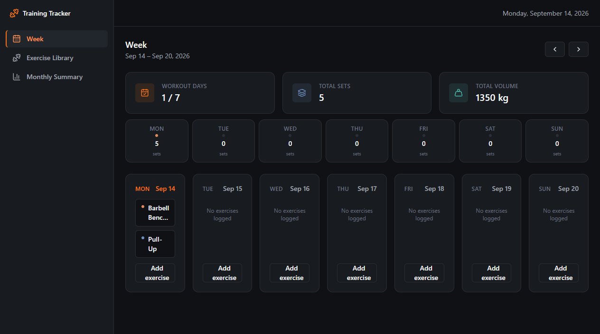
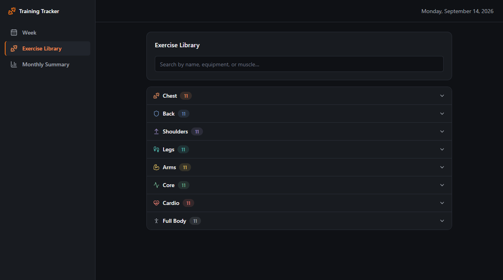
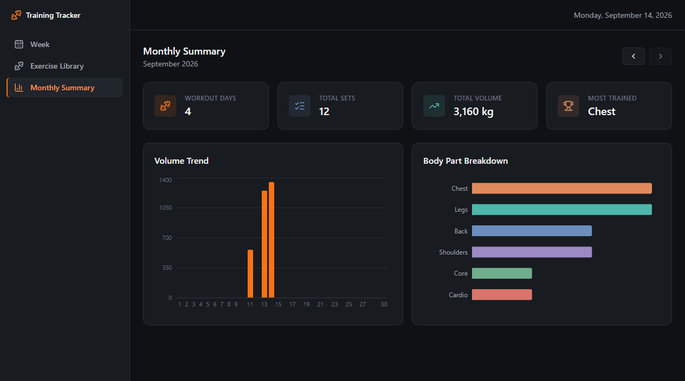

# Training Tracker

A free, local desktop workout-tracking app for planning and logging your
training week — no account, no subscription, no server. Everything you log
stays on your own machine.

## What is this

Training Tracker is an Electron desktop app for people who want a simple,
no-frills way to plan and log their workouts without a subscription, an
account, or their data leaving their computer. It has three screens:

- **Week** — the current week (Mon–Sun) as the home screen. Add exercises to
  any day, log sets/reps/weight, and see running totals for workout days,
  sets, and volume across the week. An exercise can be marked **"Repeat
  weekly"**, so it automatically shows up on the same weekday every week
  going forward.
- **Exercise Library** — roughly 90 common exercises, grouped by body part
  (Chest, Back, Shoulders, Legs, Arms, Core, Cardio, Full Body), each with
  step-by-step instructions and a link to a YouTube search for it. The same
  browse-by-body-part picker is used when adding an exercise to a day.
- **Monthly Summary** — aggregated stats for the current month: total
  workouts, sets, volume, a volume trend chart, and a breakdown of which
  body parts you've trained most.

## Getting started

**Just want to use the app?** Build the installer yourself (see
[Packaging](#packaging) below) and run it — it installs normally and adds a
desktop shortcut. All your data lives in a local SQLite file under your
user profile; nothing is sent anywhere.

**Running from source:**

```bash
npm install
npm run dev
```

`npm run dev` starts the Vite dev server and opens an Electron window
pointed at it, with hot reload for the renderer and auto-restart for the
main process.

**Building your own installer:**

```bash
npm run package
```

Produces an NSIS installer and a portable `.exe` in `release/` (see
[Packaging](#packaging) below).

## Screenshots

**Week** — the home screen: add exercises per day, log sets/reps/weight,
track totals for the week.



**Exercise Library** — browse ~90 exercises grouped by body part.



**Monthly Summary** — totals, volume trend, and body-part breakdown for the
current month.



## Scripts

| Script | What it does |
|---|---|
| `npm run dev` | Start the app in development (Electron + Vite dev server, hot reload) |
| `npm run build` | Type-check, then build the renderer (`dist/`) and main/preload (`dist-electron/`) |
| `npm run package` | Build, then package a Windows installer + portable exe into `release/` |
| `npm run lint` | Lint with oxlint |
| `npm run preview` | Preview the built renderer in a plain browser (no Electron/native APIs) |

## Project layout

```
electron/            Main process, preload script, IPC + SQLite persistence
src/
  components/         Shared UI kit (Button, Card, Modal, AppShell, ...)
  theme/              Color tokens (mirrors tailwind.config.js)
  lib/
    data/             Shared types, the WorkoutTrackerApi contract, mock + real
                       implementations, date/summary helpers
    hooks/            Feature-owned data hooks (useWeek, useMonth)
  features/
    exercise-library/ Exercise browser + ExercisePicker
    weekly-tracker/   Weekly log view (default route, "/")
    monthly-summary/  Monthly charts/summary
  routes.tsx          The 3 app routes + sidebar nav items
docs/CONTRACTS.md      Shared data contracts + folder-ownership rules
docs/screenshots/       Images used in this README
build-resources/       App icon (icon.ico, icon.png) used for the packaged
                        installer/exe and the window icon
```

See `docs/CONTRACTS.md` for the full data contracts, theme tokens, and
folder-ownership rules if you're working on one of the feature areas.

## Data & persistence

All workout data lives in a single SQLite file under the OS's per-user app
data folder (`app.getPath('userData')/training-tracker.db`) — nothing is
sent anywhere. The exercise catalog is a static seed list bundled with the
app (`src/lib/data/mockApi.ts`), not user-editable data, so it isn't stored
in SQLite.

## Data & licensing

The exercise catalog (names, instructions, equipment) was written from
scratch for this app — no exercise photos ship with it, and every exercise
links out to a YouTube search instead of a hardcoded video, to avoid
redistributing anyone else's media. See
`src/features/exercise-library/assets/LICENSE_NOTES.md` for the full
reasoning and what to check before adding real photos/illustrations later.

## Packaging

```bash
npm run package
```

Produces an NSIS installer and a portable `.exe` in `release/`. No code
signing is configured (unsigned builds — Windows SmartScreen may warn on
first run).

## Tech stack

- Electron (desktop shell) + React 19 + TypeScript
- Vite 8 (`vite-plugin-electron` for the main/preload build + dev reload)
- Tailwind CSS (`darkMode: 'class'`, the app is always-dark)
- better-sqlite3 (local persistence) + recharts (charts) + date-fns + uuid
- electron-builder (Windows packaging: NSIS installer + portable exe)
